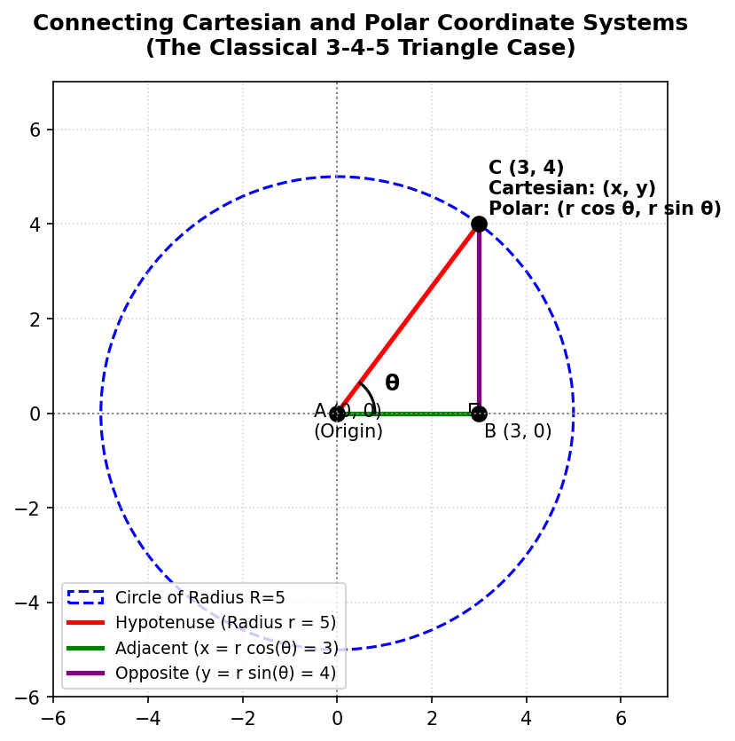
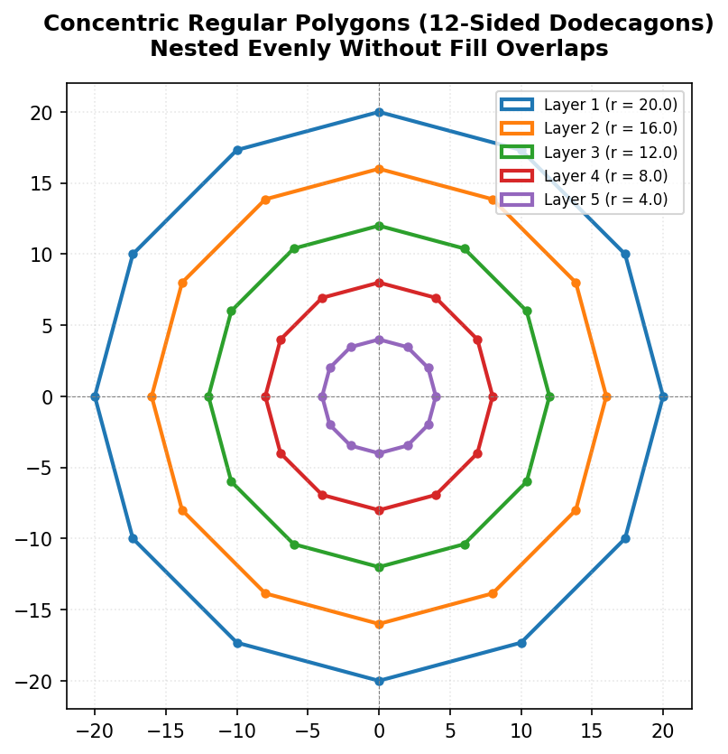
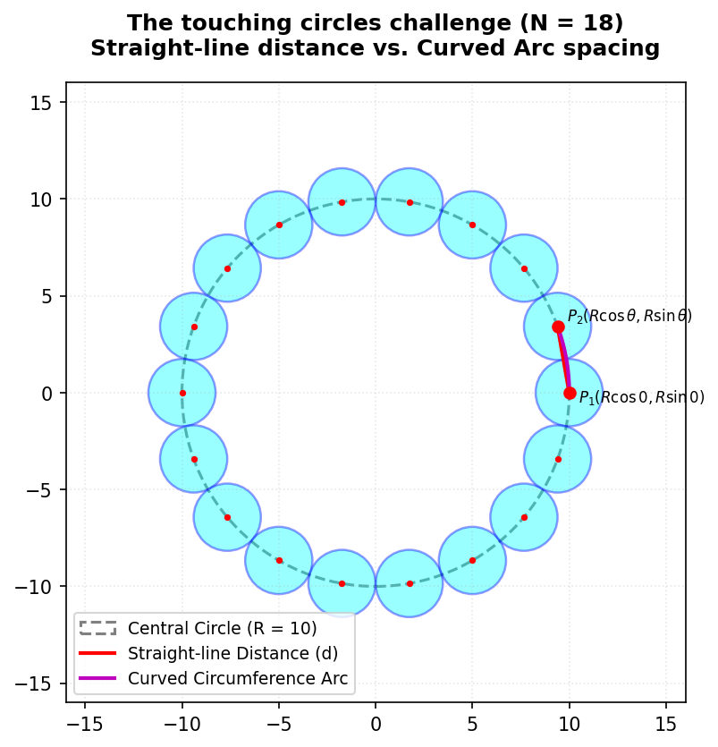

## 1. Introduction: Why Matplotlib is Not a Pen (Matplotlib vs. Turtle)

Let's begin by looking at a fundamental geometric shape: a regular pentagon. If I asked you to draw a pentagon, how would you go about it? If you have done logo design or used **Turtle graphics** before, your first instinct is probably to tell the pen: 
*"Go forward 120 steps, turn left by 72 degrees, go forward 120, turn left by 72..."* and repeat that five times.

That works beautifully in Turtle because Turtle is essentially a pen with a heading—it is vector drawing based on relative moves. But let me drop the first major reality check: **that relative turning business does not exist in Matplotlib**.

Matplotlib is not a pen; it doesn't understand "go forward" or "turn left". Instead, Matplotlib requires a **coordinate grid**. If you want to draw a line, you must specify its exact starting and ending coordinate points. If you want to draw a polygon, you must provide a list of all its vertices. 

Matplotlib has a function called `Polygon` under its `patches` library. If you give it the coordinate points of the vertices, it will draw the polygon in one go. You don't need five lines of command; you just need the vertices. 

But how do you find those vertices? Where do they lie on this two-dimensional plane? 

---

## 2. The Coordinate Challenge: Drawing a Polygon from Scratch

Let's try to figure out the vertices manually without any advanced tools. Let's assume we place our regular pentagon straight on the x-axis, not tilted, and we decide that the bottom-left corner starts at the origin $(0, 0)$.

```
           C (top vertex)
          / \
         /   \
        /     \
   D (left)  E (right)
      |         |
      |         |
      +---------+
    A(0,0)     B(20,0)
```

If the base length is $20$, then the second vertex on the x-axis is easy: it's at $(20, 0)$. But now where is the next vertex? If we go up and slightly to the right, how do we find its exact coordinates? 

One of you might guess: *"Well, maybe we go 5 points more along x, so it is at (25, y)?"* 
But what is $y$? And if the side lengths must all be exactly $20$, does that coordinate satisfy it?  

If we try to hand-calculate the coordinates of every vertex of a regular pentagon using only simple linear measurements, we run into immediate mathematical friction. Finding the coordinates of the slanted corners becomes incredibly difficult. 

This is why mathematics is a cumulative subject. To solve this, we must reach back into our toolkit and combine two seemingly separate ideas: **trigonometry** and **coordinate geometry**.

---

## 3. Bringing in Trigonometry: The Circular Coordinate System

Let's remind ourselves of how we define $\sin\theta$ and $\cos\theta$ using the unit circle.

If we draw a circle with its center at the origin $(0, 0)$ and a radius of $r$:



Any point $C$ on the circumference of this circle can be connected back to the origin, forming a right-angled triangle $ABC$ with the x-axis. 
* Let the angle with the positive x-axis be $\theta$.
* The hypotenuse is the radius $r$.
* The adjacent side along the x-axis is $AB$.
* The opposite side along the y-axis is $BC$.

By definition:
$$\cos\theta = \frac{\text{Adjacent}}{\text{Hypotenuse}} = \frac{AB}{r} \implies AB = r \cos\theta$$ 
$$\sin\theta = \frac{\text{Opposite}}{\text{Hypotenuse}} = \frac{BC}{r} \implies BC = r \sin\theta$$ 

Because $AB$ represents the horizontal displacement (the x-coordinate) and $BC$ represents the vertical displacement (the y-coordinate), the coordinates of our point $C$ are simply:
$$(x, y) = (r \cos\theta, r \sin\theta)$$ 

This is the bridge between the **Cartesian coordinate system** $(x, y)$—which specifies perpendicular distances from the axes—and the **circular (or polar) coordinate system** $(r, \theta)$—which specifies a point by its straight-line distance from the origin ($r$) and its angle from the positive x-axis ($\theta$).

### The 3-4-5 Triangle Case
Let's see if this matches what we know. Suppose we have a circle of radius $r = 5$, and a point with an adjacent side of $3$ and an opposite side of $4$. 
Using the Pythagorean theorem:
$$x^2 + y^2 = 3^2 + 4^2 = 9 + 16 = 25 = r^2$$ 
This is a perfect fit. Here:
$$\cos\theta = \frac{3}{5} \implies x = 5 \cos\theta = 3$$ 
$$\sin\theta = \frac{4}{5} \implies y = 5 \sin\theta = 4$$ 

### Going in Reverse: Cartesian to Polar
If you are given a point in $(x, y)$ and need to find its polar equivalents $(r, \theta)$:
1. **Find the radius ($r$):** By Pythagoras, the distance from the center is:
   $$r = \sqrt{x^2 + y^2}$$ 
2. **Find the angle ($\theta$):** The tangent ratio is opposite over adjacent:
   $$\tan\theta = \frac{y}{x} \implies \theta = \tan^{-1}\left(\frac{y}{x}\right)$$ 

### Why do we need Polar Coordinates?
When we think in circles, Polar coordinates $(r, \theta)$ make intuitive sense. If you want to trace points along a circle, $r$ remains constant, and you only need to vary $\theta$. Trying to do this directly in Cartesian $(x, y)$ coordinates would require calculating complex quadratic boundaries ($x^2 + y^2 = r^2$) for every single point. 

For regular polygons, whose vertices all lie perfectly on a circle, the circular coordinate system is a massive mathematical superpower!

---

## 4. Radians: Measuring Angles Naturally

When we think of dividing a circle, we normally think in degrees ($360^\circ$ for a full circle, $72^\circ$ for a pentagon, $60^\circ$ for a hexagon). But let me ask you: is dividing a circle into 360 parts a *natural* way of doing things?  

No, it's completely arbitrary. We could have divided it into 100 parts, or 240 parts. In mathematics and computers, we use a much more organic, natural unit of angle measurement: the **radian**.

### What is a Radian?
Imagine taking the radius ($r$) of a circle and bending it along the curved circumference of that same circle. The angle subtended at the center of the circle by an arc of this length is exactly **1 radian**.

```
                _---_
              /   r   \  <- Length of arc = r
             /    |    \
            |     |     |
            |     +-----|  <- Center (0, 0)
             \  theta  /
              \   |   /  <- Angle theta = 1 Radian
                -___-
```

Because the entire circumference of a circle of radius $r$ is $2\pi r$, we can ask: how many radius lengths fit along the circumference? 
$$\text{Number of Radians in a Circle} = \frac{\text{Circumference}}{\text{Radius}} = \frac{2\pi r}{r} = 2\pi\text{ radians}$$ 

Thus, a full circle of $360^\circ$ is exactly equal to $2\pi$ radians:
* $360^\circ = 2\pi\text{ rad}$ 
* $180^\circ = \pi\text{ rad}$ 
* $90^\circ = \frac{\pi}{2}\text{ rad}$ 

Matplotlib and NumPy operate **exclusively** in radians. When writing code, we must specify angles using multiples of `np.pi`.

---

## 5. Looping Geometry: From Hardcoded Points to Parametric Loops

Now that we have the mathematical foundation, let's write some code to draw a pentagon. A regular pentagon has 5 vertices, meaning the circle is split into 5 equal slices. The angle between each vertex is:
$$\theta = \frac{2\pi}{5} = 72^\circ$$ 

Let's begin by setting up our canvas and hardcoding the coordinates for the vertices to see the pattern.

### Step 1: The Hardcoded Coordinate Progression

```python
import numpy as np
import matplotlib.pyplot as plt
from matplotlib.patches import Circle

# Setup a square coordinate grid
fig, ax = plt.subplots()
ax.set_aspect(1)  # Keeps x and y scales 1:1 so circles don't look like ovals!
ax.set_xlim(-15, 15)
ax.set_ylim(-15, 15)

R = 10
theta = 2 * np.pi / 5  # 72 degrees in radians

# First point is on the positive x-axis (0 degrees)
x0 = R * np.cos(0 * theta)
y0 = R * np.sin(0 * theta)

# Second point is turned by 1 step of theta
x1 = R * np.cos(1 * theta)
y1 = R * np.sin(1 * theta)

# Third point is turned by 2 steps of theta
x2 = R * np.cos(2 * theta)
y2 = R * np.sin(2 * theta)

# Fourth point is turned by 3 steps of theta
x3 = R * np.cos(3 * theta)
y3 = R * np.sin(3 * theta)

# Fifth point is turned by 4 steps of theta
x4 = R * np.cos(4 * theta)
y4 = R * np.sin(4 * theta)

# Draw small marker circles at each vertex to verify they are correct
ax.add_patch(Circle((x0, y0), 0.5, color='red'))
ax.add_patch(Circle((x1, y1), 0.5, color='blue'))
ax.add_patch(Circle((x2, y2), 0.5, color='green'))
ax.add_patch(Circle((x3, y3), 0.5, color='purple'))
ax.add_patch(Circle((x4, y4), 0.5, color='orange'))

plt.show()
```

Look at the progression of the indices in those coordinate definitions: $0 \cdot \theta$, $1 \cdot \theta$, $2 \cdot \theta$, $3 \cdot \theta$, $4 \cdot \theta$. This mathematical consistency is a clear signal that we can compress this entire block into a single loop!

### Step 2: The Parametric Loop for a Regular Polygon

Instead of generating vertices by hand, let's write a loop where $i$ runs from $0$ to $\text{sides} - 1$. This code will dynamically construct any regular polygon we want, whether it is a pentagon (5 sides), a hexagon (6 sides), or a dodecagon (12 sides)!

```python
import numpy as np
import matplotlib.pyplot as plt
from matplotlib.patches import Polygon

fig, ax = plt.subplots()
ax.set_aspect(1)
ax.set_xlim(-15, 15)
ax.set_ylim(-15, 15)

R = 10
sides = 5
theta = 2 * np.pi / sides  # Calculate the step angle

vertices = []
for i in range(sides):
    # Calculate coordinate of vertex 'i'
    angle = i * theta
    x = R * np.cos(angle)
    y = R * np.sin(angle)
    vertices.append((x, y))

# Create the Polygon patch
polygon = Polygon(vertices, closed=True, facecolor='none', edgecolor='black', linewidth=2)
ax.add_patch(polygon)

plt.show()
```

---

## 6. The Next Step: Nesting Polygons (Nested Loops)

Now let's try something more complex: drawing concentric regular polygons nested inside one another, which is a key structural building block for circular **mandalas**.

To do this, we want to decrease our radius $r$ layer by layer. Let's say we want $5$ layers.

### The "Default Fill Color" Trap
When we first ran nested loops to draw multiple polygons, we encountered an odd issue: we could only see one giant blue polygon. Why? Because by default, Matplotlib fills polygons with a solid color. The larger outer polygons were drawn first (or last), and they ended up completely overlapping and hiding the smaller inner polygons.

To fix this, we must set `facecolor='none'` (or specify a transparent fill) so that only the edges are drawn.

Here is the nested loop structure to draw concentric 12-sided polygons (dodecagons):



```python
import numpy as np
import matplotlib.pyplot as plt
from matplotlib.patches import Polygon

fig, ax = plt.subplots(figsize=(6, 6))
ax.set_aspect(1)
ax.set_xlim(-22, 22)
ax.set_ylim(-22, 22)

sides = 12
outer_radius = 20
layers = 5

# Outer loop: Iterates over the layers, changing the radius r
for i in range(layers):
    # Evenly space the radii from outer_radius down to 4
    r = outer_radius * (layers - i) / layers
    theta = 2 * np.pi / sides
    
    vertices = []
    # Inner loop: Calculates the vertices for a single polygon at radius 'r'
    for j in range(sides):
        angle = j * theta
        x = r * np.cos(angle)
        y = r * np.sin(angle)
        vertices.append((x, y))
        
    # Draw the polygon with transparent fill to prevent blocking inner layers
    polygon = Polygon(vertices, closed=True, facecolor='none', edgecolor='blue', linewidth=1.5)
    ax.add_patch(polygon)

plt.show()
```

---

## 7. The Ultimate Challenge: Arranging Touching Circles Around a Circumference

Let's move to a much harder geometry problem. Imagine we want to draw $n$ small circles arranged in a circular ring around a larger central circle of radius $R$. We want these smaller circles to be perfectly spaced so that they **touch each other exactly**, without overlapping and without any gaps.

```
                   O (Small Circle)
                 /   \
                /     \
               O       O
              /         \
             |     +     |  <- Central Circle of Radius R
              \         /
               O       O
                 \   /
                   O
```

To achieve this, we can easily locate the centers of the small circles: they lie along the circumference of the main circle at angles spaced by $\theta = 2\pi / n$. But how do we determine the exact radius ($r_{\text{small}}$) of the small circles? 

### Two Competing Approaches

There are two ways to think about this problem:

1. **The Curved Arc Distance Approach:**  
   We know the circumference of the central circle is $2\pi R$. If we divide this circumference into $n$ parts, that should give us the diameter of each small circle. Therefore, the radius is:
   $$r_{\text{small}} = \frac{\text{Circumference}}{2 \cdot n} = \frac{2\pi R}{2n} = \frac{\pi R}{n}$$ 

2. **The Straight-line Distance Approach:**  
   Instead of using the curved circumference, we calculate the coordinates of two adjacent circle centers, find the straight-line distance $d$ (chord length) between them, and divide that by 2.
   * Adjacent Center 1: $P_1 = (R \cos(0), R \sin(0)) = (R, 0)$ 
   * Adjacent Center 2: $P_2 = (R \cos\theta, R \sin\theta)$ where $\theta = 2\pi / n$ 
   
   Using the distance formula:
   $$d = \sqrt{(x_2 - x_1)^2 + (y_2 - y_1)^2}$$ 
   $$r_{\text{small}} = \frac{d}{2}$$ 

### Why the Curved Arc Method Causes Overlap

At first glance, this method seems logical. But there is a subtle geometric catch: **the curved arc distance is always greater than the straight-line distance**.



When you measure a curved path along a circle's edge and then "straighten" it out to use as a radius, that radius will be slightly longer than the straight line connecting the two centers. 
If you use this radius, the small circles will be too large and will overlap. The radius of each circle is a straight-line vector, so we *must* calculate the straight-line distance between centers.

### Implementing Perfectly Touching Circles (N = 18)

Here is how we implement this geometry in Python using the straight-line distance formula to calculate $r_{\text{small}}$:

```python
import numpy as np
import matplotlib.pyplot as plt
from matplotlib.patches import Circle

fig, ax = plt.subplots(figsize=(6, 6))
ax.set_aspect(1)
ax.set_xlim(-16, 16)
ax.set_ylim(-16, 16)

R = 10
n_circles = 18
theta = 2 * np.pi / n_circles

# 1. Calculate the coordinates of two adjacent center points
x1, y1 = R * np.cos(0), R * np.sin(0)
x2, y2 = R * np.cos(theta), R * np.sin(theta)

# 2. Use the distance formula to find the straight-line distance (d)
d = np.sqrt((x2 - x1)**2 + (y2 - y1)**2)

# 3. The radius of our touching circles is half of that distance
r_small = d / 2

# Draw the background central path circle
central_path = Circle((0, 0), R, fill=False, color='gray', linestyle='--')
ax.add_patch(central_path)

# 4. Loop around and place the 18 small circles
for i in range(n_circles):
    angle = i * theta
    cx = R * np.cos(angle)
    cy = R * np.sin(angle)
    
    # Create and add the small circle patch
    small_circle = Circle((cx, cy), r_small, facecolor='cyan', edgecolor='blue', alpha=0.6)
    ax.add_patch(small_circle)

plt.title(f"18 Perfectly Touching Circles (Radius = {r_small:.3f})")
plt.show()
```

---

## 8. Conclusion and Homework

In computational design, mathematics and code are inextricably linked. A beautiful mandala or clean scientific visualization is simply the physical expression of precise coordinate geometry and loops.

Before our next class on Thursday, please make sure you review and practice the following homework tasks:

1. **The Verbal Rebuild:** Be prepared to stand up and explain the Cartesian coordinate system $(x, y)$, the Polar coordinate system $(r, \theta)$, and how they relate using trigonometry ($x = r\cos\theta, y = r\sin\theta$).
2. **Loop Construction:** Write a Python script from scratch that allows a user to input any variable `sides` and dynamically draws that regular polygon on a square Matplotlib grid.
3. **Circle Path:** Complete the pseudocode implementation for drawing 12 and 18 perfectly touching circles around a central circular track. Pay close attention to how your nested loops are structured!
