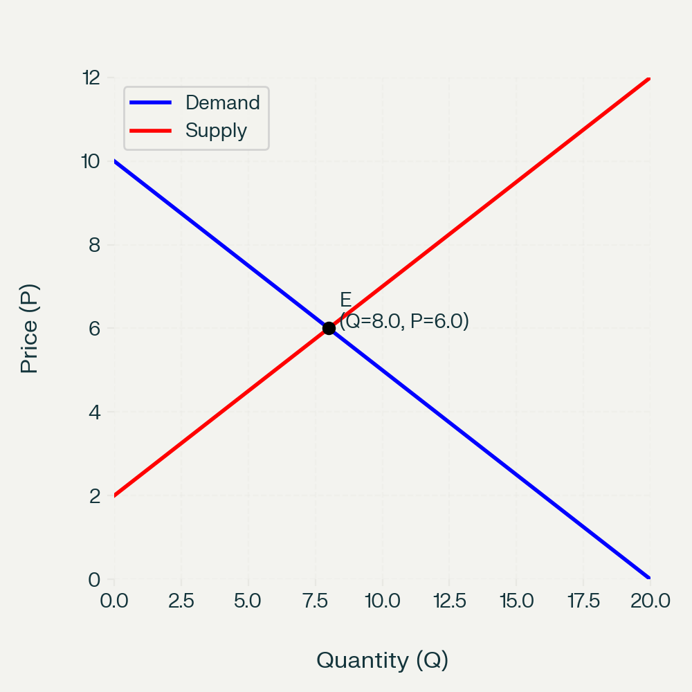
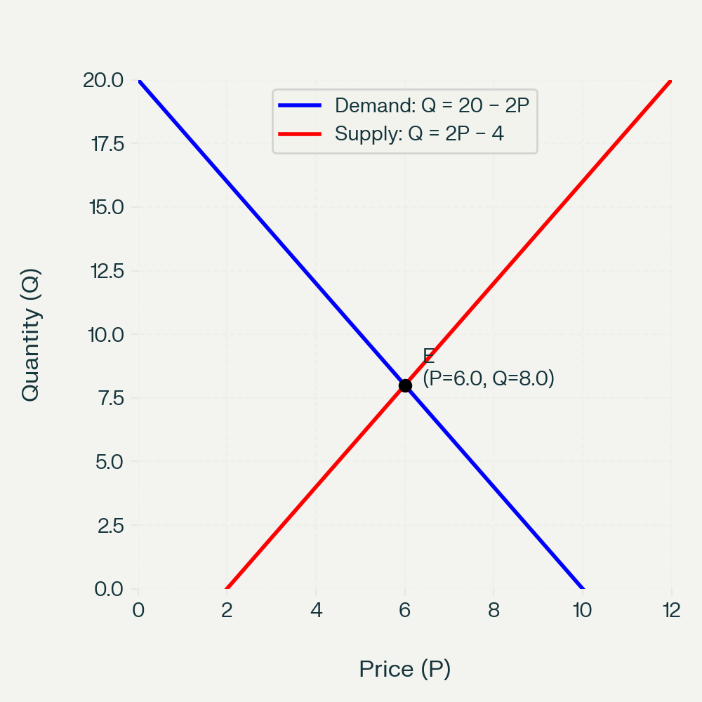

## Question

In mathematics and most sciences, we are taught to put the **independent variable on the x‑axis** and the **dependent variable on the y‑axis**.  

Yet in introductory economics, supply and demand diagrams have:

- **Price (P)** on the **vertical (y) axis**
- **Quantity (Q)** on the **horizontal (x) axis**

But we often say things like “quantity demanded depends on price” or “quantity supplied depends on price”.  

**Why, then, is quantity on the x‑axis and price on the y‑axis in standard supply–demand diagrams?**

---

## Teacher Explanation

### 1. It is mainly a historical convention

The standard diagram comes from **Alfred Marshall’s** *Principles of Economics* (1890). Marshall chose to draw:

- **Quantity** on the horizontal axis  
- **Price** on the vertical axis  

even though he understood that, mathematically, one can think of quantity demanded or supplied as a function of price.

Because Marshall’s textbook became so influential, this convention became standard in the Anglo‑American economics tradition. Later authors kept it for **consistency and comparability**, even though it goes against the usual maths convention.

So a large part of the answer is simply: **this is how Marshall drew it, and everyone followed**.

---

### 2. Economists are plotting *inverse* demand and supply

In many models we write:

- Demand: $Q_d = D(P)$ – quantity demanded as a function of price  
- Supply: $Q_s = S(P)$ – quantity supplied as a function of price  

But the diagram you see in class is actually drawing the **inverse functions**:

- Inverse demand: $P = D^{-1}(Q)$ – the price consumers are willing to pay for each quantity  
- Inverse supply: $P = S^{-1}(Q)$ – the price producers need to supply each quantity  

In Marshall’s way of thinking:

- For any given quantity $Q$, the **demand curve** shows the **maximum price** consumers are willing to pay for that extra (marginal) unit.
- For any given $Q$, the **supply curve** shows the **minimum price** producers need to be willing to supply that extra unit (their marginal cost).

So in that view:

- **Quantity is treated as the “driver”**: “If the market sells this much, what price does that imply on the demand side? On the supply side?”
- **Price is the outcome variable** that adjusts to equate quantity demanded and quantity supplied.

Thus, the diagram is consistent if you think of it as plotting **price as a function of quantity**, i.e. the inverse demand and inverse supply curves.

---

### 3. Two ways to draw the same curves

The same underlying relationships can be drawn in two orientations.

#### (A) Marshallian (economics) convention  
**Quantity on x‑axis, Price on y‑axis**

This is the standard diagram used in almost all introductory economics textbooks and exams.

- Demand slopes downward: as $Q$ increases, the marginal willingness to pay falls.
- Supply slopes upward: as $Q$ increases, the marginal cost of production rises.
- Equilibrium $E$ is where the two curves cross.

#### (B) Mathematics convention  
**Price as independent (x), Quantity as dependent (y)**

Here we treat:

- $Q_d = D(P)$ and $Q_s = S(P)$ explicitly, with **price on the horizontal axis** and **quantity on the vertical axis**.

The curves represent the same relationships; they are just **re‑expressed** and **re‑oriented**.

---

### 4. Why don’t we switch to the “maths” convention?

You *could* teach supply and demand with price on the x‑axis and quantity on the y‑axis. Some advanced texts do this when it is convenient. But introductory economics keeps Marshall’s convention because:

- **Standardisation**: All textbooks, exam boards, and policy graphs use the same orientation, so everyone can read each other’s diagrams.
- **Intuition about shifts**: It is very visual to think of “demand shifts right” or “supply shifts right” and immediately see the new equilibrium price and quantity in the same layout.
- **Surplus and elasticity**: Concepts like consumer surplus, producer surplus, and elasticity are taught using this standard picture; changing axes would confuse learners more than it helps.

So the diagram is not wrong; it is just using a **different but consistent convention** that the whole discipline has adopted.

---

## How to explain this to students

You might say:

- “In maths, we usually put the independent variable on the x‑axis. In economics, the supply–demand diagram is a **historical convention from Marshall**.”
- “The curves you see are really **inverse functions**: price as a function of quantity.”
- “Quantity is treated as the ‘given’, and price is the ‘resulting market price’ that clears the market.”
- “Everyone in economics uses this convention, so we stick with it to match textbooks, exams, and other economists’ graphs.”

If students ask, “So which is correct?” you can answer:

- “Both are mathematically fine. Economists have just agreed to use Marshall’s orientation for all the standard diagrams.”

---

## Optional extension for advanced students

For more advanced classes, you can:

- Write demand as $Q_d = a - bP$ and then derive the inverse demand $P = \frac{a}{b} - \frac{1}{b}Q$.
- Show explicitly how the same line looks in both orientations.
- Discuss how some research papers and advanced texts switch axes depending on what is most convenient for the analysis.

This helps students see that the choice of axes is a **modelling and presentation choice**, not a deep truth about the relationship.
